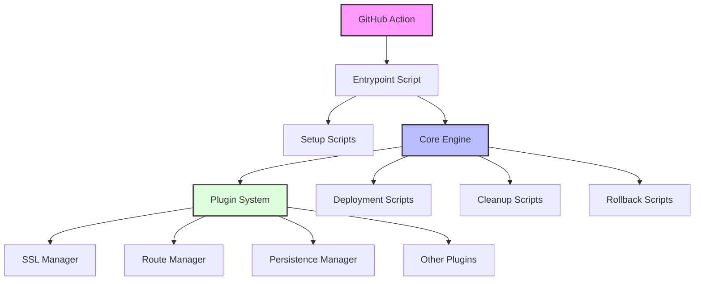

# UDS Architecture Guide

## Overview

Unified Deployment System follows a modular architecture designed around core principles of reliability, security, and extensibility. This document explains how the different components interact and the design patterns used throughout the system.

## System Components



### Core Component Responsibilities

1. **Core Engine (`uds-core.sh`)**: Provides fundamental utilities and functions used by all other components:
   - Configuration loading and validation
   - Security primitives
   - Logging and error handling
   - Service registry management
   - Plugin system foundation
   - Port and network management

2. **Deployment System (`uds-deploy.sh`)**: Manages the application deployment lifecycle:
   - Single-stage and multi-stage deployments
   - Health checking with automatic detection
   - Automatic rollback capabilities
   - Version tracking for reliable deployments

3. **Plugin System**: Provides extensibility through a hook-based design:
   - Pre/post deployment hooks
   - Specialized functionality (SSL, routing, persistence, etc.)
   - Event-driven architecture for modularity

## Key Workflows

### Multi-Stage Deployment Flow

```mermaid
sequenceDiagram
    participant User
    participant UDS
    participant Docker
    participant Target
    
    User->>UDS: Deploy command
    UDS->>UDS: Validate settings
    UDS->>Docker: Check dependencies
    UDS->>UDS: Prepare staging environment
    UDS->>Docker: Deploy to staging
    UDS->>UDS: Run health checks
    alt Healthy
        UDS->>UDS: Create backup
        UDS->>UDS: Cut over to production
        UDS->>UDS: Verify deployment
        UDS->>User: Success
    else Unhealthy
        UDS->>UDS: Rollback
        UDS->>User: Failure details
    end
    
    style User fill:#f9f
    style UDS fill:#bbf
    style Docker fill:#dfd
```

### GitHub Actions Integration

The GitHub Action runs a containerized UDS environment that:

1. Creates a secure SSH connection to the deployment target
2. Transfers configuration and prepares the environment
3. Executes the deployment process remotely
4. Monitors the success and reports status

## Design Principles

1. **Fail Fast, Fail Safely**: UDS prioritizes early detection of issues and robust error handling
2. **Secure by Default**: Security considerations are built into every operation
3. **Modular Extensibility**: Plugin system allows adding functionality without modifying core code
4. **Stateful Awareness**: Version tracking and rollback support maintain system integrity

## Implementation Details

### Service Registry

The service registry (`service-registry.json`) is a central database that:

- Tracks all deployed applications
- Stores version history for rollbacks
- Maintains configuration metadata
- Enables service discovery between components

### Health Check System

The health check subsystem:

- Auto-detects appropriate check mechanism based on container type
- Supports HTTP, TCP, database-specific, and custom command health checks
- Implements exponential backoff for resilience
- Collects diagnostic information on failures

## Under the Hood

For developers interested in extending UDS, understanding these internal mechanics is essential:

- **Hook Registration**: Plugins register callbacks for specific lifecycle events
- **Configuration Validation**: Strong validation prevents common deployment issues
- **Permission Model**: Secure file handling with appropriate permission levels
- **Sanitization**: Sensitive data is automatically redacted from logs

By understanding these architectural components, developers can effectively leverage UDS for complex deployment scenarios while maintaining security and reliability.
