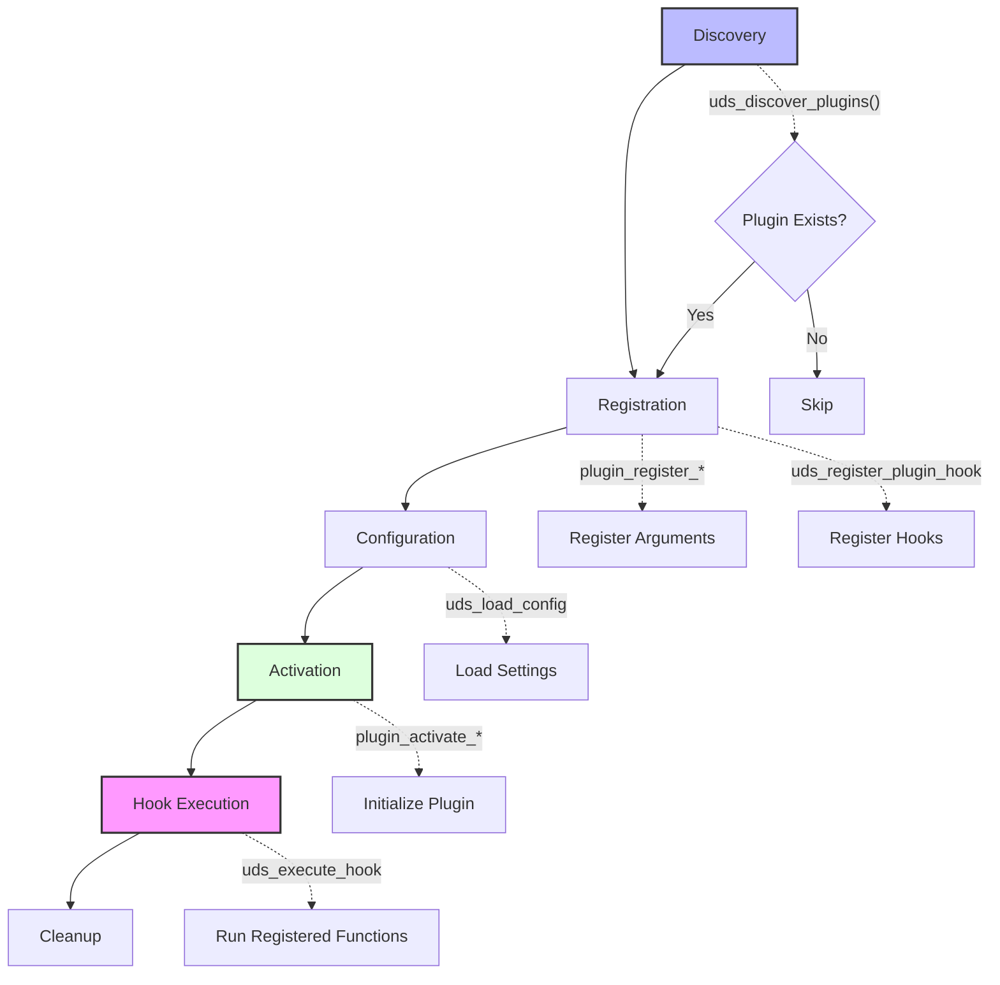

# Plugin Development Guide for UDS

This guide explains how to create custom plugins for the Unified Deployment System to extend its functionality.

## Plugin System Overview

The UDS plugin system provides a way to extend the core functionality through hooks that are called at specific points in the deployment lifecycle. Plugins can:

- Register custom parameters
- Hook into different deployment phases
- Modify configurations
- Interact with external systems
- Add specialized functionality

## Plugin Lifecycle



1. **Discovery**: UDS scans the `plugins` directory for `.sh` files
2. **Registration**: Plugins register their hooks and arguments
3. **Configuration**: Plugin-specific settings are loaded from the configuration
4. **Activation**: Plugins are activated if specified in the configuration
5. **Hook Execution**: Plugin hooks are called during the deployment process
6. **Cleanup**: Plugins perform cleanup operations if needed

## Creating a Basic Plugin

### 1. Plugin Structure

Create a new file in the `plugins` directory with a `.sh` extension:

```bash
#!/bin/bash
#
# my-custom-plugin.sh - Custom plugin for UDS
#
# This plugin adds specialized functionality to UDS

# Registration function (required)
plugin_register_my_custom_plugin() {
  uds_log "Registering My Custom Plugin" "debug"
  
  # Register plugin arguments (configuration parameters)
  uds_register_plugin_arg "my_custom_plugin" "MY_CUSTOM_SETTING" "default_value"
  
  # Register plugin hooks
  uds_register_plugin_hook "my_custom_plugin" "pre_deploy" "plugin_custom_pre_deploy"
  uds_register_plugin_hook "my_custom_plugin" "post_deploy" "plugin_custom_post_deploy"
}

# Activation function (optional but recommended)
plugin_activate_my_custom_plugin() {
  uds_log "Activating My Custom Plugin" "debug"
  
  # Perform initialization here
  mkdir -p "${UDS_BASE_DIR}/custom"
}

# Hook implementation functions
plugin_custom_pre_deploy() {
  local app_name="$1"
  local app_dir="$2"
  
  uds_log "Executing custom pre-deploy tasks for $app_name" "info"
  
  # Your custom logic here
  echo "Custom setting value: ${MY_CUSTOM_SETTING}"
}

plugin_custom_post_deploy() {
  local app_name="$1"
  local app_dir="$2"
  
  uds_log "Executing custom post-deploy tasks for $app_name" "info"
  
  # Your custom logic here
}
```

### 2. Available Hooks

UDS provides the following hook points:

| Hook Name | Description | Parameters |
|-----------|-------------|------------|
| `config_loaded` | After configuration is loaded | `$APP_NAME` |
| `pre_setup` | Before system setup | `$APP_NAME` |
| `post_setup` | After system setup | `$APP_NAME`, `$APP_DIR` |
| `pre_deploy` | Before deployment starts | `$APP_NAME`, `$APP_DIR` |
| `post_deploy` | After successful deployment | `$APP_NAME`, `$APP_DIR` |
| `pre_cleanup` | Before cleanup | `$APP_NAME`, `$APP_DIR` |
| `post_cleanup` | After cleanup | `$APP_NAME` |
| `pre_rollback` | Before rollback | `$APP_NAME`, `$APP_DIR` |
| `post_rollback` | After rollback | `$APP_NAME`, `$APP_DIR` |
| `post_cutover` | After cutover in multi-stage | `$APP_NAME`, `$APP_DIR` |
| `health_check_failed` | When health check fails | `$APP_NAME`, `$APP_DIR` |

### 3. Best Practices

1. **Naming Convention**: Use descriptive plugin and function names
2. **Documentation**: Include comments describing your plugin's functionality
3. **Error Handling**: Always include proper error handling
4. **Logging**: Use `uds_log` for consistent output
5. **Security**: Follow security best practices for handling sensitive data
6. **Independence**: Plugins should be self-contained and not depend on other plugins
7. **Configuration**: Make your plugin configurable with sensible defaults

## Advanced Plugin Techniques

### Sharing Data Between Hooks

To share data between different hook functions:

```bash
# Create a file in a known location
plugin_custom_pre_deploy() {
  echo "shared_data" > "${UDS_BASE_DIR}/tmp/${APP_NAME}_custom_data"
}

plugin_custom_post_deploy() {
  if [ -f "${UDS_BASE_DIR}/tmp/${APP_NAME}_custom_data" ]; then
    local shared_data=$(cat "${UDS_BASE_DIR}/tmp/${APP_NAME}_custom_data")
    # Use the data
    rm "${UDS_BASE_DIR}/tmp/${APP_NAME}_custom_data"
  fi
}
```

### Accessing Core UDS Functions

Plugins have access to all exported UDS functions, including:

- `uds_log`: For logging
- `uds_secure_permissions`: For setting secure permissions
- `uds_generate_compose_file`: For generating Docker Compose files
- `uds_create_nginx_config`: For creating Nginx configurations
- `uds_reload_nginx`: For reloading Nginx
- `uds_register_service`: For registering services
- `uds_get_service`: For getting service information
- `uds_find_available_port`: For finding an available port

### Plugin Configuration Integration

To integrate your plugin configuration with UDS:

1. Add your plugin name to the `plugins` field in the configuration:
```json
{
  "plugins": "ssl-manager,my-custom-plugin"
}
```

2. Add plugin-specific settings in the environment variables:
```json
{
  "env_vars": {
    "MY_CUSTOM_SETTING": "custom_value"
  }
}
```

## Testing Your Plugin

Create a test configuration:

```json
{
  "app_name": "plugin-test",
  "image": "nginx",
  "domain": "example.com",
  "plugins": "my-custom-plugin"
}
```

Run a test deployment:

```bash
./scripts/uds-deploy.sh --config=test-config.json --log-level=debug
```

## Example Plugins

For more examples, see the built-in plugins:
- `ssl-manager.sh`: Manages SSL certificates
- `route-manager.sh`: Handles routing configuration
- `persistence-manager.sh`: Manages persistent data
- `telegram-notifier.sh`: Sends notifications to Telegram

## Troubleshooting Plugin Issues

1. **Plugin Not Loading**: Ensure the plugin is in the correct directory and has execute permissions
2. **Hook Not Executing**: Verify that the hook is registered correctly with `uds_register_plugin_hook`
3. **Configuration Not Available**: Check that plugin arguments are registered with `uds_register_plugin_arg`
4. **Plugin Not Activated**: Ensure the plugin name is included in the `plugins` configuration field

By following this guide, you can create powerful plugins that extend UDS functionality to meet your specific deployment needs.
