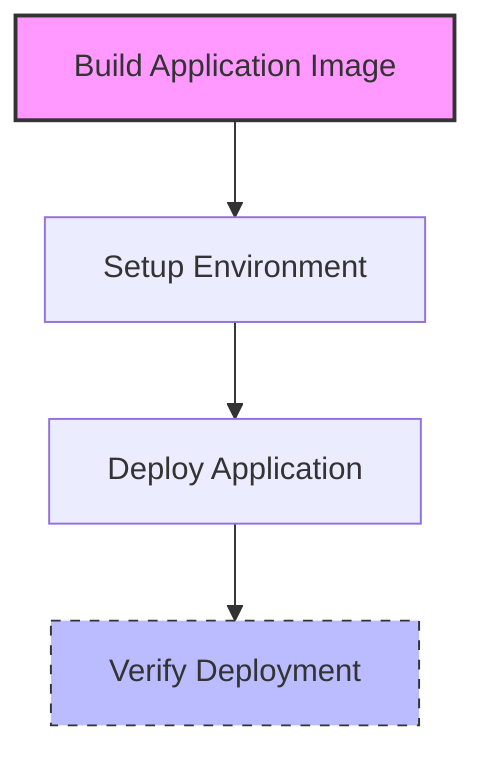
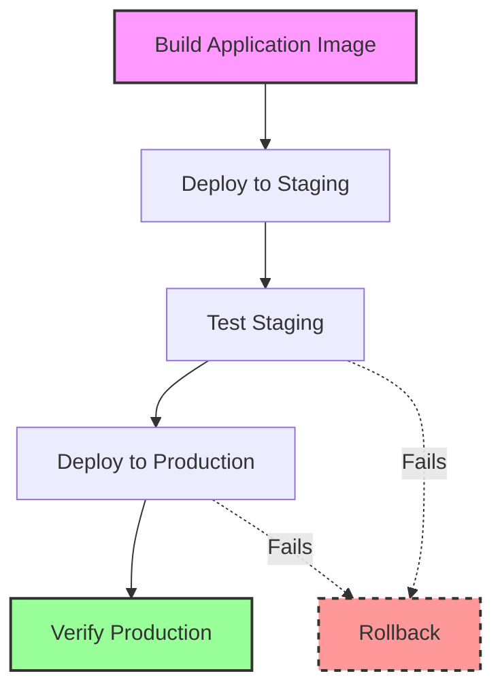
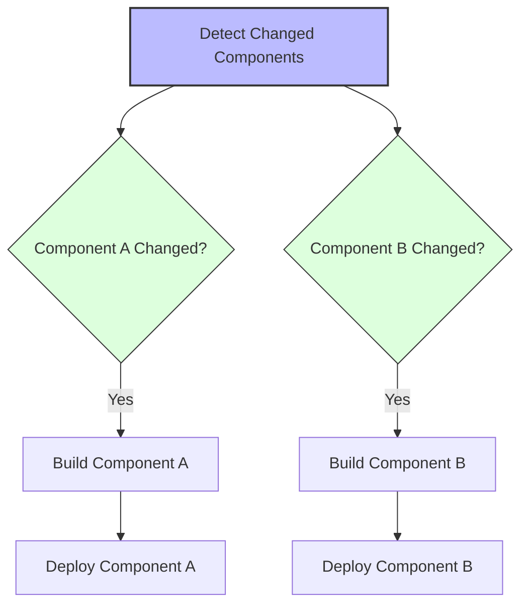
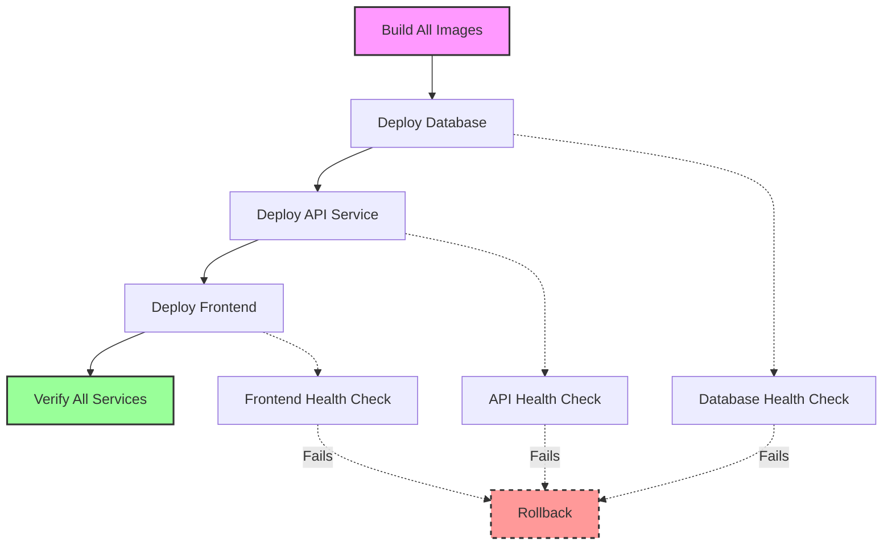

# UDS Workflow Patterns

This guide explains common deployment workflow patterns that can be implemented with UDS GitHub Actions.

## Overview

UDS supports various workflow patterns to fit different deployment needs, from simple applications to complex multi-service architectures. This document explains the patterns implemented in our example workflows and how to adapt them to your needs.

## Basic Deployment Pattern

**Example Implementation:** [basic-workflow.yml](../examples/basic-workflow.yml)



The basic pattern follows this sequence:
1. Build application image
2. Set up deployment environment
3. Deploy application
4. (Optional) Verify deployment

**When to use this pattern:**
- Simple applications with a single service
- Projects just getting started with CI/CD
- When quick deployment cycles are needed

**Implementation details:**
```yaml
jobs:
  build:
    # Build the Docker image
  deploy:
    needs: build
    # Deploy the application
```

## Multi-Stage Deployment Pattern

**Example Implementation:** [advanced-workflow.yml](../examples/advanced-workflow.yml)



The multi-stage pattern follows this sequence:
1. Build application image
2. Deploy to staging environment
3. Run tests against staging
4. Deploy to production environment
5. Verify production deployment

**When to use this pattern:**
- Applications requiring thorough testing before production
- When downtime in production must be minimized
- Complex applications with multiple components

**Implementation details:**
```yaml
jobs:
  build:
    # Build the Docker image
  deploy-staging:
    needs: build
    # Deploy to staging
  test-staging:
    needs: deploy-staging
    # Test the staging deployment
  deploy-production:
    needs: test-staging
    # Deploy to production
  post-deploy:
    needs: deploy-production
    # Verify and finalize deployment
```

## Monorepo Deployment Pattern

**Example Implementation:** [monorepo-workflow.yml](../examples/monorepo-workflow.yml)



The monorepo pattern:
1. Detects which components have changed
2. Builds only the affected components
3. Deploys components in dependency order

**When to use this pattern:**
- Projects with multiple applications in a single repository
- When you need to deploy components independently
- Microservice architectures

**Implementation details:**
```yaml
jobs:
  detect-changes:
    # Determine which components have changed
  build-component-a:
    needs: detect-changes
    if: ${{ needs.detect-changes.outputs.component-a == 'true' }}
    # Build component A
  deploy-component-a:
    needs: build-component-a
    # Deploy component A
  # Similar jobs for other components
```

## Robust Multi-Service Pattern

**Example Implementation:** [robust-workflow.yml](../examples/robust-workflow.yml)



The robust multi-service pattern:
1. Deploys infrastructure components first (databases, etc.)
2. Deploys application services with dependencies
3. Provides intelligent health checking with retry logic
4. Implements comprehensive verification

**When to use this pattern:**
- Production systems requiring high reliability
- Applications with data persistence requirements
- Complex architectures with multiple dependent services

**Implementation details:**
```yaml
jobs:
  build:
    # Build all Docker images
  deploy-database:
    needs: build
    # Deploy database with persistence
  deploy-api:
    needs: deploy-database
    # Deploy API service depending on database
  deploy-frontend:
    needs: deploy-api
    # Deploy frontend depending on API
  verify:
    needs: [deploy-frontend]
    # Comprehensive verification
```

## Customizing These Patterns

To adapt these patterns for your own projects:

1. **Modify the build process** to match your application's build requirements
2. **Adjust the dependencies** between jobs to match your service dependencies
3. **Configure the deployment parameters** for your specific environment needs
4. **Add custom verification** steps relevant to your application

See the [Configuration Reference](configuration.md) for all available configuration options.

## Automated Rollback

All patterns can be enhanced with automated rollback capabilities:

```yaml
with:
  command: deploy
  app-name: my-app
  multi-stage: 'true'  # Enables safer deployments with rollback capability
  version-tracking: 'true'  # Required for rollback functionality
```

For more information on rollback capabilities, see [Troubleshooting Guide](troubleshooting.md#recovery-procedures).

## Best Practices

1. **Always use version tracking** to enable rollback capability
2. **Implement health checks** for all services
3. **Use multi-stage deployment** for critical applications
4. **Secure sensitive values** using GitHub Secrets
5. **Include meaningful verification steps** after deployment
